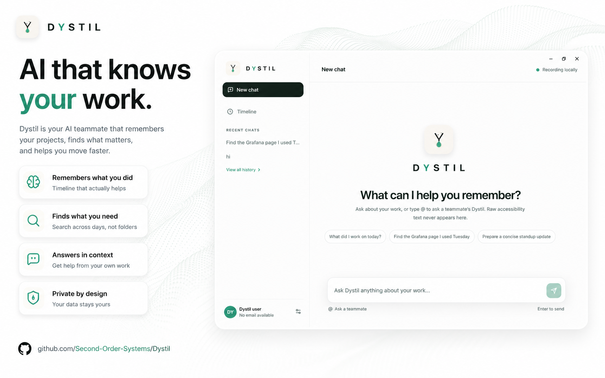
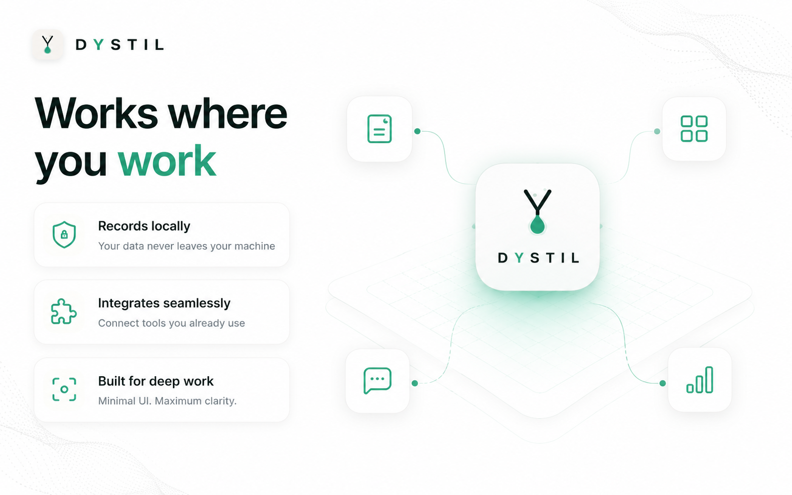
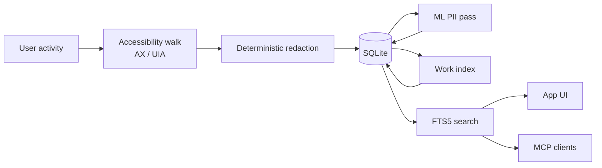

<div align="center">
  

  <h1>Dystil</h1>

  <p><strong>Dystil finds the work you keep redoing, and makes it something you can reuse.</strong></p>
  <p>A private desktop app that watches how you work, notices what repeats, and turns it into instructions that can do that work again. On your machine.</p>

  <p><code>Rust</code> · <code>Tauri v2</code> · <code>Next.js</code> · <code>SQLite</code> · <code>Ollama</code> · <code>MCP</code></p>

  <p>
    <a href="#the-loop">How it works</a> ·
    <a href="#getting-started">Getting started</a> ·
    <a href="#architecture">Architecture</a> ·
    <a href="#privacy">Privacy</a> ·
    <a href="#individual-vs-teams">Teams</a>
  </p>
</div>

<p align="center">
  
</p>

> [!NOTE]
> The open-source app is built for **one person on their own machine**, and it is
> complete on its own. **Teams** — shared automations, managed sync, administration —
> is the commercial edition. See [Individual vs Teams](#individual-vs-teams).

> [!IMPORTANT]
> **Dystil sends anonymous usage counts, and it is on by default.** Counts and
> timings only — never what Dystil read, and never window titles, app names, URLs,
> file paths, prompts, or model replies. Nothing is sent until you finish setting up.
>
> Turn it off in **Settings → Send anonymous usage counts**, or set
> `DYSTIL_TELEMETRY=0`. Full payload list: [What we send](#what-we-send).

---

## What Dystil is

You already know the work you do over and over. The Friday report rebuilt from six
places. The customer details copied between two apps. The review that catches the
same mistake every time.

Dystil watches how you work, finds those, and turns them into something reusable.
You never write anything down for it, and you never have to remember to use it —
it arrives with the finding.

**What it is not:** a note-taking app, a day planner, or a chatbot over your
history. It can tell you what you did on Tuesday, but that is a by-product. The
point is automation.

<!-- MEDIA SLOT 1 — hero screenshot. See public_docs/media/BRIEF.md -->

---

## The loop

<p align="center">
  
</p>

### 1 · Worth fixing

Dystil surfaces work that repeats, with the evidence that led it there. You did not
ask it to look.

<!-- MEDIA SLOT 2 — Worth fixing screen, a finding with its evidence expanded -->

### 2 · Ask for fix

You clarify. It asks what it misunderstood and which reading is closer. Your
judgement is the one input it cannot generate.

<!-- MEDIA SLOT 3 — Ask for fix conversation -->

### 3 · Ready to use

What you keep. Reusable instructions for work you want done the same way again —
the report, the reply, the summary, done to the standard you would want if you had
the time.

<!-- MEDIA SLOT 4 — Ready to use, saved artifacts -->

---

## Why Dystil

**It finds work you did not think to ask about.** Most automation tools need you to
already know what to automate and to sit down and build it. Dystil brings you the
finding and the evidence.

**It runs on your machine.** Capture, redaction, storage, and search are local.
Point it at [Ollama](https://ollama.com) and inference is local too — no API key,
no per-token cost, nothing leaving the device.

**Your judgement stays yours.** Dystil does the groundwork that repeats, not the
deciding.

**It plugs into the agents you already use.** Your work history is available over
MCP to Claude Code, Codex, or any MCP client — bounded and sanitized, never a raw
database dump.

---

## Three situations

**The same work, over and over.** You copy customer details between two apps a
dozen times a week. Dystil notices the shape, shows you the evidence, and builds
the step you keep doing by hand.

**Work that arrives on a schedule.** Every Friday you rebuild the same client report
from scattered files. Dystil recognises the pattern across weeks, not just within
one, and hands you a reusable version.

**The same avoidable mistake.** Your final review catches the same errors every
time. Dystil surfaces the recurrence — and once it is written down, it stops being
something you have to remember.

---

## Status

Honest about what runs today.

**✅ Works today**
- Activity-triggered capture via OS accessibility APIs (macOS AX, Windows UIA)
- Two-pass local PII redaction — deterministic before storage, ML model after
- Local SQLite storage with full-text search
- Worth fixing → Ask for fix → Ready to use
- Local models via Ollama; Anthropic, OpenAI, and custom endpoints
- MCP server exposing bounded search over your work
- Per-app, per-site, and per-range deletion

**🚧 Being wired up**
- Self-hosted operational telemetry
- Broader automation execution

**💭 Planned**
- Semantic search over the work index (retrieval is keyword-based today)
- Team mode: peer questions answered locally, sharing only what you approve

---

## Getting started

### Prerequisites

- [Rust toolchain](https://rustup.rs) — version pinned by `rust-toolchain.toml`
- [Bun](https://bun.sh) — the package manager for this repo
- [Tauri v2 system dependencies](https://v2.tauri.app/start/prerequisites/)
- [Ollama](https://ollama.com) if you want local inference (optional but recommended)

### Run it

```bash
git clone https://github.com/Second-Order-Systems/Dystil.git
cd Dystil/apps/dystil
bun install
bunx tauri dev
```

`tauri dev` starts the Next.js frontend and the Rust backend together. Running
`cargo run` against `src-tauri` directly will not work — it skips the frontend.

### Build it

```bash
cd apps/dystil
bunx tauri build
```

Same command CI runs.

Dystil needs operating-system accessibility permission to see anything, and will
request it on first launch. If it gets denied or the grant goes stale after an
update, the app has a recovery screen that walks you back through it.

### Connect a model

Point Dystil at a running Ollama instance (`http://localhost:11434` by default) and
it will list the models you have already pulled. Or configure Anthropic, OpenAI, or
any OpenAI-compatible endpoint in settings.

---

## Architecture

| Layer | Technology |
| --- | --- |
| Desktop shell | Tauri v2 |
| Frontend | Next.js, React, TypeScript |
| Backend | Rust, Tokio |
| Storage | SQLite (FTS5 for search) |
| Redaction | Local ONNX model + deterministic detectors |
| Inference | Your provider — Ollama, Anthropic, OpenAI, or custom |
| Agent integration | Model Context Protocol |
| Sync | Optional, off by default |



Capture is **activity-triggered, not continuous** — it records around moments of
intent rather than running a tape.

<details>
<summary><strong>Repository map</strong></summary>

```text
apps/dystil/           Tauri desktop app with a Next.js frontend

crates/
  dystil-capture/      Accessibility, UI-event, window, optional visual capture
  dystil-redact/       Local text redaction (text only — images never inspected)
  dystil-storage/      SQLite schema, migrations, persistence
  dystil-work-index/   Deterministic surface visits from captured frames
  dystil-retrieval/    Agent-safe retrieval over sanitized evidence
  dystil-insights/     Worth Fixing inference and projection
  dystil-ai/           Provider-neutral, privacy-bounded AI support
  dystil-automation/   Automation definitions, persistence, execution
  dystil-mcp/          Dystil capabilities exposed over MCP
  dystil-telemetry/    Privacy-safe telemetry schema and aggregation
  dystil-engine/       Optional orchestration and sync engine
  dystil-sync/         Optional peer and cloud synchronization
  dystil-protocol/     Multiplayer and wire-protocol types

cloud/                 Optional self-hosted ingest and telemetry services
agent_docs/            Verified engineering reference
public_docs/           Positioning and marketing
```

</details>

Full technical detail lives in [`agent_docs/`](agent_docs/README.md).

---

## Token use

Dystil calls whichever model provider you configure, so cost is yours to control.
Measured **per active hour** — an hour in which Dystil actually observed work, not
wall-clock uptime.

| Per active hour | Ollama (local) | Claude | GPT |
| --- | --- | --- | --- |
| Input tokens | n/a | _TBD_ | _TBD_ |
| Output tokens | n/a | _TBD_ | _TBD_ |
| Cost | **$0** | _TBD_ | _TBD_ |
| Leaves your machine | nothing | prompt + bounded context | prompt + bounded context |
| Works offline | yes | no | no |

> Figures marked _TBD_ are being measured. We would rather leave them blank than
> publish an estimate you might budget against.

---

## Privacy

> Everything Dystil has read stays in one folder on this machine, and there is no
> copy of it to ask for.

Captured content is never transmitted. What Dystil read about your work does not
leave the device — not to us, not to anyone.

| Boundary | Default |
| --- | --- |
| Captured activity | Local SQLite, on the originating device. Never transmitted. |
| Sensitive text | Redacted twice — deterministically before storage, then by a local ML model |
| Screenshots | Off |
| Inference | Local if you use Ollama; otherwise your chosen provider |
| Anonymous usage counts | **On** — see [What we send](#what-we-send). One switch to disable. |
| Cloud endpoint | **Not compiled into open-source builds** |
| Accounts | Not required |

The cloud row is worth being precise about: it is not a setting that defaults to
off. `cloud_base_url()` is `option_env!`, so the endpoint is absent from the
community binary, and `app_config.rs :: community_build_has_no_cloud_url` fails if
that changes.

### What we send

Anonymous operational counters, every five minutes, to a Dystil-operated endpoint:

| Included | Never included |
| --- | --- |
| Counts of capture runs, successes, failures | Anything Dystil read |
| Durations and error categories (as fixed enums) | Window titles, app names, URLs |
| App version, platform, architecture | File paths, document names |
| An install ID (random, not tied to you) | Prompts, model replies, model endpoints |
| Edition (community or enterprise) | Evidence, findings, artifacts, database contents |

The payload carries no free text. Every attribute is a bounded enum or a number,
enforced by the schema in `crates/dystil-telemetry/src/schema.rs` — there is a test,
`registry_has_no_known_sensitive_attribute_keys`, that fails if a sensitive key is
added.

**Turning it off:**

```bash
DYSTIL_TELEMETRY=0        # environment, wins over everything
```

or **Settings → Send anonymous usage counts**. Disabling also clears whatever has
been counted locally but not yet sent.

**Nothing is sent before onboarding completes**, so you see this disclosure in the
app before the first payload leaves. If you build from source without setting
`DYSTIL_TELEMETRY_ENDPOINT`, your build has no endpoint and cannot report at all.

In enterprise builds telemetry is organization-managed and configured by your
administrator.

You can delete captured data by time range, by application, or by site, or reset
everything. Deleting activity also removes what Dystil derived from it.

**One honest caveat:** if you choose a hosted provider, your prompts and their
bounded context go to that provider. Dystil does not require one.

Details: [`agent_docs/PRIVACY_AND_TELEMETRY.md`](agent_docs/PRIVACY_AND_TELEMETRY.md).
Please report security issues privately rather than opening a public issue.

---

## Individual vs Teams

| | Individual (open source) | Teams |
| --- | --- | --- |
| The full loop, running locally | ✅ | ✅ |
| Local models, no API key | ✅ | ✅ |
| MCP access for your agents | ✅ | ✅ |
| Anonymous usage counts | on, one switch to disable | organization-managed |
| Cloud endpoint compiled in | never | managed sync |
| Screenshot + segment capture | — | consent-gated |
| Signed official builds | build it yourself | ✅ |
| Shared automations, admin | — | ✅ |

The open-source edition is not a trial. For one person it is the whole product, and
it keeps the stronger guarantee where it counts: no cloud endpoint is compiled in at
all, and the usage counters are one switch away from off.

---

## Contributing

`AGENTS.md` in the repo root is the fastest orientation for both people and coding
agents — build commands, layout, and the conventions that matter.

One rule worth knowing up front: `agent_docs/` is verified and cites the code;
`public_docs/` is positioning and may run ahead of it. Never implement from the
latter.

---

## License

Apache License 2.0.
