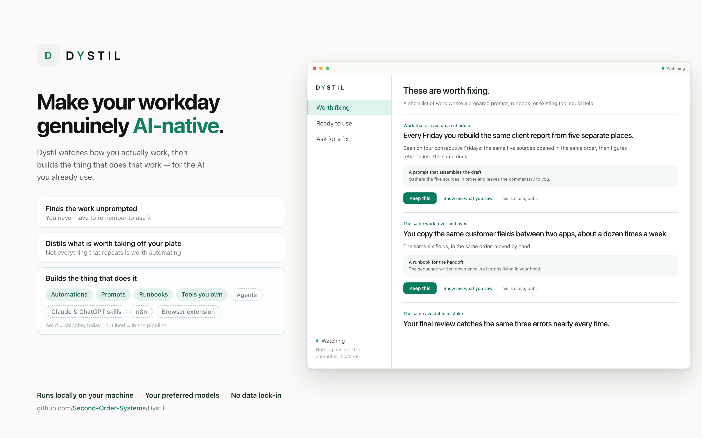
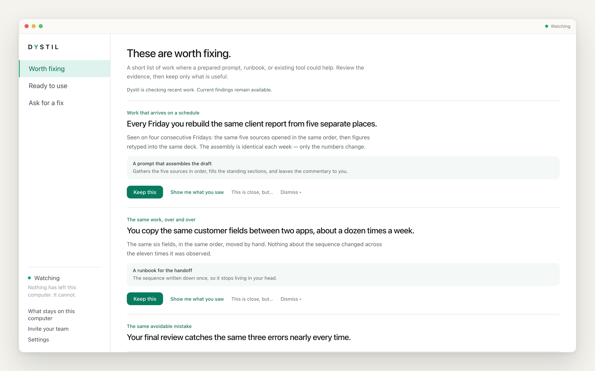
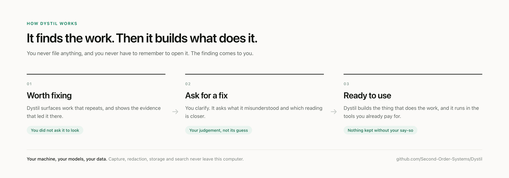
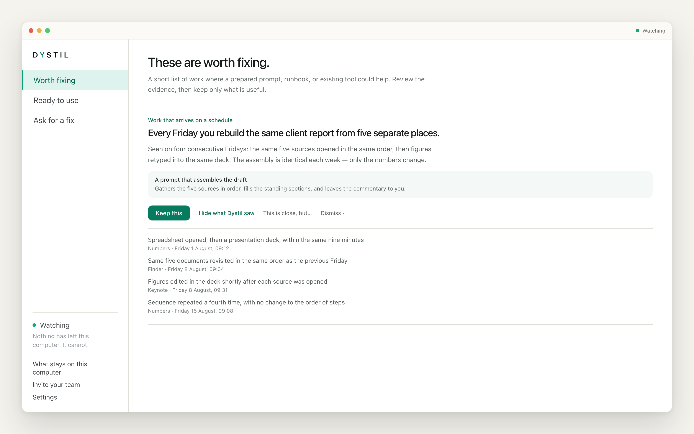
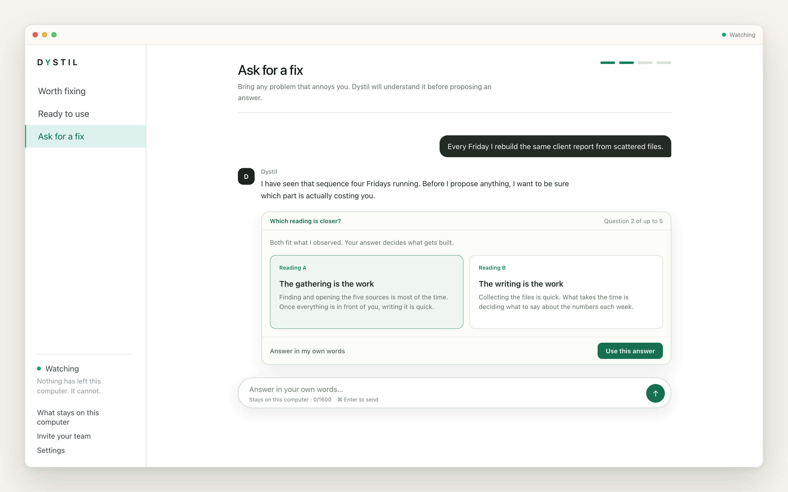
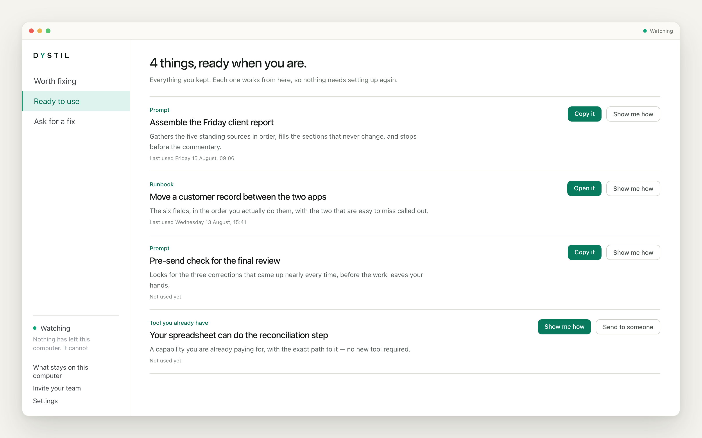
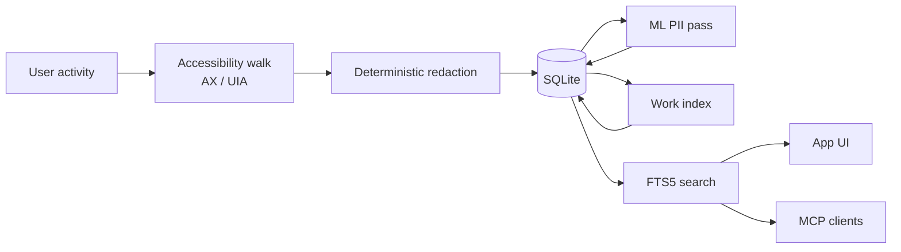

<div align="center">
  

  <h1>Dystil</h1>

  <p><strong>It watches how you work, then builds the AI that does it.</strong></p>
  <p>Automations, prompts and agents fitted to how you actually work — for the AI you already use. On your machine, from your own evidence.</p>

  <p><code>Rust</code> · <code>Tauri v2</code> · <code>Next.js</code> · <code>SQLite</code> · <code>Ollama</code> · <code>MCP</code></p>

  <p>
    <a href="#what-dystil-does">What it does</a> ·
    <a href="#getting-started">Getting started</a> ·
    <a href="#architecture">Architecture</a> ·
    <a href="#privacy">Privacy</a> ·
    <a href="#for-teams">For teams</a>
  </p>
</div>

<p align="center">
  
</p>

---

## Everyone has a solution. Nobody's looked at your work.

You have the models. You have the tools. You have probably paid for a few of them.
And your day still looks almost exactly like it did before.

That is not a tooling problem. The hard part was never running a model — it is
knowing which parts of your work should stop being done by hand, and in what order.
Nobody can tell you that. Every vendor arrives with the answer already chosen, and
none of them have watched how work actually moves through your day.

So you buy the answer and hope it matches the question. Impressions, not evidence.

**Dystil starts from the other end.**

> ### It finds the work, asks you the one thing it cannot infer, and builds the agent, automation, or skill that does it.

Not a report. Not a list of recommendations you still have to act on. Dystil finds
the work, shows you the evidence, asks you the questions only you can answer, and
builds the thing that does it — an agent, an automation wired into Claude or
ChatGPT or n8n, a skill, a browser extension that works where you already work.

You never write anything down for it. You never have to remember to use it. The
finding comes to you.

<p align="center">
  
</p>

> [!IMPORTANT]
> **Dystil sends anonymous usage counts, and it is on by default.** Counts and
> timings only — never what Dystil read, and never window titles, app names, URLs,
> file paths, prompts, or model replies. Nothing is sent until you finish setting up.
> Turn it off in **Settings → Send anonymous usage counts**, or set
> `DYSTIL_TELEMETRY=0`. Details: [Privacy](#privacy).

---

## What Dystil does

<p align="center">
  
</p>

Three surfaces, in order. This is the whole product.

### 1 · Worth fixing

Dystil surfaces work that repeats, with the evidence that led it there. You did not
ask it to look — that is the difference between this and a tool you have to
remember to open.

<p align="center">
  
</p>

Every finding opens. "Show me what you saw" lists what it actually observed, so you
can disagree with it.

### 2 · Ask for fix

You clarify. It asks what it misunderstood and which reading is closer. Your
judgement is the one input it cannot generate — and the one that makes what comes
out fitted to you rather than tuned on someone else's work.

<p align="center">
  
</p>

### 3 · Ready to use

What you keep, and what runs. The automation, the prompt, the runbook — the report,
the reply, the summary, done to the standard you would want if you had the time.
See [What it builds](#what-it-builds) for the full list, including what is still
being built.

<p align="center">
  
</p>

**What this is not:** a note-taking app, a day planner, or a chatbot over your
history. It can tell you what you did on Tuesday, but that is a by-product. The
point is getting the work done without you.

---

## What it looks for

Repetition is only the easiest thing to spot. These are the five shapes Dystil
watches for — the same list the app shows you on day one.

**The same work, over and over.** You do it the same way every time. If nothing
about it changes, it does not need you.

**Work that arrives on a schedule.** The Monday report, the month-end close. Most of
that time is setup and waiting, and it can be done before you sit down.

**Work where you make the call.** The judgement has to be yours. Rebuilding the same
groundwork before every one of them does not.

**Work that could come out better.** The report, the reply, the summary. Done to the
standard you would want if you had the time.

**What you would do if you had the time.** The prep before the call, the check
before the decision. Skipped because the day is full, not because it does not
matter.

The last two are the ones no automation tool asks you about, because you would never
think to put them on a list.

---

## What it builds

Not advice. Something that runs — in the tools you already pay for, not in a
console you have to learn.

| What Dystil builds | | |
| --- | --- | --- |
| **Automations** that run through Claude Code or Codex | Shipping | ✅ |
| **Prompts** — reusable instructions for work you want done the same way again | Shipping | ✅ |
| **Runbooks** — a clear sequence for work that still needs your judgment | Shipping | ✅ |
| **A tool you already own** — the path to a capability you are already paying for | Shipping | ✅ |
| **Agents** fitted to how you work, not tuned on someone else's | Building | 🚧 |
| **Skills** for Claude and ChatGPT | Building | 🚧 |
| **Workflows** for n8n and the automation tools you already run | Building | 🚧 |
| **A browser extension** that works where the work happens | Building | 🚧 |

> ✅ works in the current build. 🚧 is what we are building next.

Nothing is kept unless you keep it, and each one traces back to the evidence it
came from.

---

## Why it can do this

**It works from evidence, not from a questionnaire.** Most automation tools need you
to already know what to automate and to sit down and build it. Dystil brings you the
finding and what led to it.

**It runs on your machine.** Capture, redaction, storage, and search are local.
Point it at [Ollama](https://ollama.com) and inference is local too — no API key, no
per-token cost, nothing leaving the device.

**Your judgement stays yours.** Dystil does the groundwork that repeats, not the
deciding.

**It plugs into the agents you already use.** Your work history is available over
MCP to Claude Code, Codex, or any MCP client — bounded and sanitized, never a raw
database dump.

---

## Status

**✅ Works today**
- Activity-triggered capture via OS accessibility APIs (macOS AX, Windows UIA)
- Two-pass local PII redaction — deterministic before storage, ML model after
- Local SQLite storage with full-text search
- Worth fixing → Ask for fix → Ready to use
- Prompts, runbooks, and pointers to tools you already own
- Automations executed through Claude Code or Codex, with per-run logs
- Local models via Ollama; Anthropic, OpenAI, and any OpenAI-compatible endpoint
- MCP server exposing bounded search over your work
- Per-app, per-site, and per-range deletion

**🚧 Being built**
- Agents generated from a finding
- Skills for Claude and ChatGPT
- Workflows for n8n and similar automation tools
- A browser extension
- Broader automation execution beyond the coding-agent runners
- Self-hosted operational telemetry

**💭 Planned**
- Semantic search over the work index (retrieval is keyword-based today)
- Team mode: peer questions answered locally, sharing only what you approve

---

## Getting started

### Prerequisites

- [Rust toolchain](https://rustup.rs) — version pinned by `rust-toolchain.toml`
- [Bun](https://bun.sh) — the package manager for this repo
- [Tauri v2 system dependencies](https://v2.tauri.app/start/prerequisites/)
- [Ollama](https://ollama.com) if you want local inference (optional but recommended)

### Run it

```bash
git clone https://github.com/Second-Order-Systems/Dystil.git
cd Dystil/apps/dystil
bun install
bunx tauri dev
```

`tauri dev` starts the Next.js frontend and the Rust backend together. Running
`cargo run` against `src-tauri` directly will not work — it skips the frontend.

### Build it

```bash
cd apps/dystil
bunx tauri build
```

Same command CI runs.

Dystil needs operating-system accessibility permission to see anything, and will
request it on first launch. If the grant is denied or goes stale after an update,
the app has a recovery screen that walks you back through it.

### Connect a model

Point Dystil at a running Ollama instance (`http://localhost:11434` by default) and
it will list the models you have already pulled — Llama, Mistral, Qwen, whatever you
have. Or configure Anthropic, OpenAI, or any OpenAI-compatible endpoint in settings.

---

## Architecture

| Layer | Technology |
| --- | --- |
| Desktop shell | Tauri v2 |
| Frontend | Next.js, React, TypeScript |
| Backend | Rust, Tokio |
| Storage | SQLite (FTS5 for search) |
| Redaction | Local ONNX model + deterministic detectors |
| Inference | Your provider — Ollama, Anthropic, OpenAI, or OpenAI-compatible |
| Agent integration | Model Context Protocol |
| Sync | Optional, off by default |



Capture is **activity-triggered, not continuous** — it records around moments of
intent rather than running a tape.

<details>
<summary><strong>Repository map</strong></summary>

```text
apps/dystil/           Tauri desktop app with a Next.js frontend

crates/
  dystil-capture/      Accessibility, UI-event, window, optional visual capture
  dystil-redact/       Local text redaction (text only — images never inspected)
  dystil-storage/      SQLite schema, migrations, persistence
  dystil-work-index/   Deterministic surface visits from captured frames
  dystil-retrieval/    Agent-safe retrieval over sanitized evidence
  dystil-insights/     Worth Fixing inference and projection
  dystil-ai/           Provider-neutral, privacy-bounded AI support
  dystil-automation/   Automation definitions, persistence, execution
  dystil-mcp/          Dystil capabilities exposed over MCP
  dystil-telemetry/    Privacy-safe telemetry schema and aggregation
  dystil-engine/       Optional orchestration and sync engine
  dystil-sync/         Optional peer and cloud synchronization
  dystil-protocol/     Multiplayer and wire-protocol types

agent_docs/            Verified engineering reference
public_docs/           Positioning and marketing
```

</details>

Full technical detail lives in [`agent_docs/`](agent_docs/README.md).

---

## Token use

Dystil calls whichever provider you configure, so the cost is yours to control.
Measured **per active hour** — an hour in which Dystil actually observed work, not
wall-clock uptime.

| Per active hour | Ollama (local) | Claude | GPT |
| --- | --- | --- | --- |
| Input tokens | n/a | _TBD_ | _TBD_ |
| Output tokens | n/a | _TBD_ | _TBD_ |
| Cost | **$0** | _TBD_ | _TBD_ |
| Leaves your machine | nothing | prompt + bounded context | prompt + bounded context |

> Figures marked _TBD_ are still being measured.

---

## Privacy

> Everything Dystil has read stays in one folder on this machine, and there is no
> copy of it to ask for.

**In the open-source app, captured content is never transmitted.** Processing
happens on your machine — that is what this edition is. Sensitive text is redacted
twice, deterministically before anything is written and then by a local model
afterwards. No account is required.

Teams is different by design, and it is the actual difference between the editions:
there, raw capture is processed on Dystil's servers so a team gets analysis no
single machine can do. An administrator agrees to that. If you are running the
open-source app, none of it applies to you.

**Dystil does not take screenshots unless you turn them on.** It reads accessibility
text — the same text a screen reader sees. Text-only capture is the product default,
and in that mode it never touches screen-capture APIs at all
(`capture_policy.rs :: product_capture_mode`; `recording_settings.rs` sets the
default with the note *"screenshots require an explicit user opt-in"*).

**No cloud endpoint is compiled into open-source builds.** Not disabled — absent.
`cloud_base_url()` is `option_env!`, and `app_config.rs :: community_build_has_no_cloud_url`
fails the build if that changes.

**What does leave:** anonymous operational counters — counts, timings, error
categories as fixed enums, app version, platform, a random install ID. No free text
of any kind; every attribute is a bounded enum or a number, enforced by
`registry_has_no_known_sensitive_attribute_keys`. Never anything Dystil read, and
never window titles, app names, URLs, file paths, prompts, or model replies.

Turn it off with `DYSTIL_TELEMETRY=0` or **Settings → Send anonymous usage counts**;
disabling also clears anything counted but not yet sent. Nothing is sent before
onboarding completes. A build made from source without `DYSTIL_TELEMETRY_ENDPOINT`
has no endpoint and cannot report at all.

If you choose a hosted provider, your prompts and their
bounded context go to that provider. Dystil does not require one.

You can delete captured data by time range, by application, or by site, or reset
everything — and deleting activity removes what Dystil derived from it.

Full detail: [`agent_docs/PRIVACY_AND_TELEMETRY.md`](agent_docs/PRIVACY_AND_TELEMETRY.md).
Please report security issues privately rather than opening a public issue.

---

## For teams

Everything above is one person and one machine, and for one person it is the whole
product — not a trial, not a demo of something better.

The problem gets harder with more people. The work that repeats is spread across
them, the expertise sits with whoever has been there longest, and no one has a map
of how any of it moves. **This repo is the app teams install.**

The real difference is **where the work is processed.** The open-source app does it
all on your machine, which is why nothing has to leave. Teams sends raw capture to
Dystil's servers, because finding the work that repeats *across people* is not
something one laptop can see. That is a trade, and it should be made deliberately —
by an administrator, on the record.

| | Individual (open source) | Teams |
| --- | --- | --- |
| The full loop, running locally | ✅ | ✅ |
| Local models, no API key | ✅ | ✅ |
| MCP access for your agents | ✅ | ✅ |
| Anonymous usage counts | on, one switch to disable | organization-managed |
| Cloud endpoint compiled in | never | managed sync |
| Signed official builds | build it yourself | ✅ |
| Shared automations, admin | — | ✅ |

More at **[2os.ai](https://2os.ai)**.

---

## Contributing

`AGENTS.md` in the repo root is the fastest orientation for both people and coding
agents — build commands, layout, and the conventions that matter.

One rule worth knowing up front: `agent_docs/` is verified and cites the code;
`public_docs/` is positioning and may run ahead of it. Never implement from the
latter.

---

## License

**[Apache License 2.0](LICENSE)** — the desktop application and every crate in
`crates/`. Everything that runs on your machine is open source, including the
client-side sync code. That is deliberate: in a product that reads your work, a
closed component is exactly the thing you would want to inspect.

Server-side deployment materials are outside this open-source distribution.

"Dystil" and the Dystil logo are trademarks of Second Order Systems. Apache 2.0
grants no trademark rights — you are free to fork and build on the code, but please
ship it under your own name.

Contributions are welcome under a [DCO](CONTRIBUTING.md) — no CLA, and you keep the
copyright in your work.

<div align="center">
  <sub>Specific Intelligence. Built with you.</sub>
</div>
