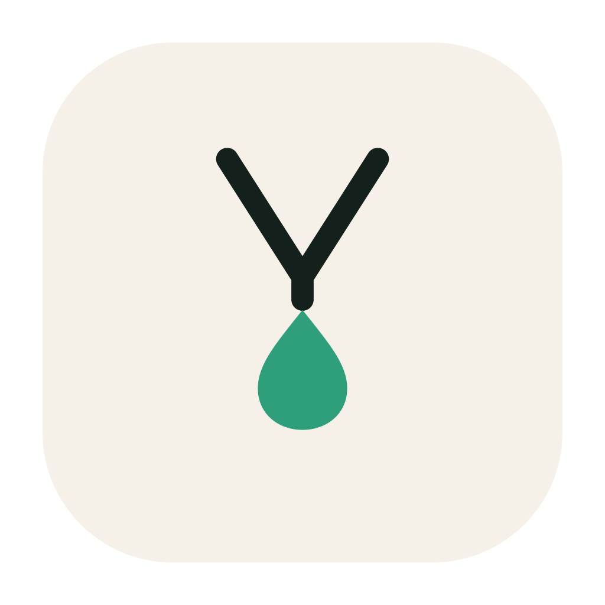
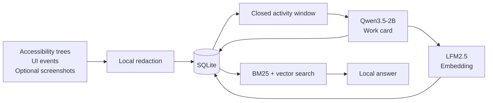
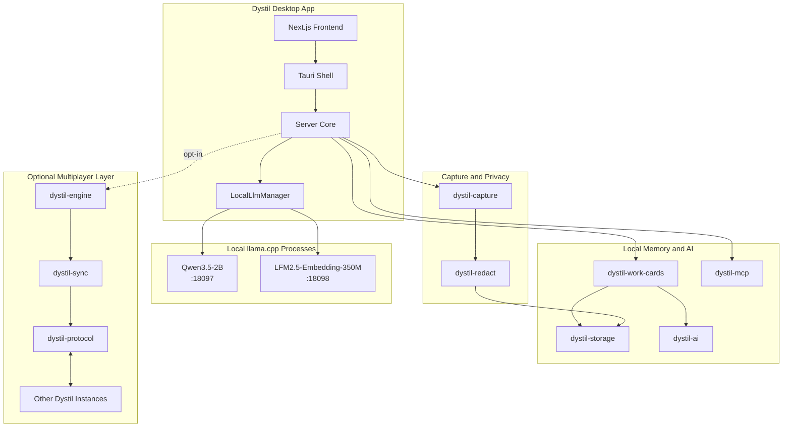
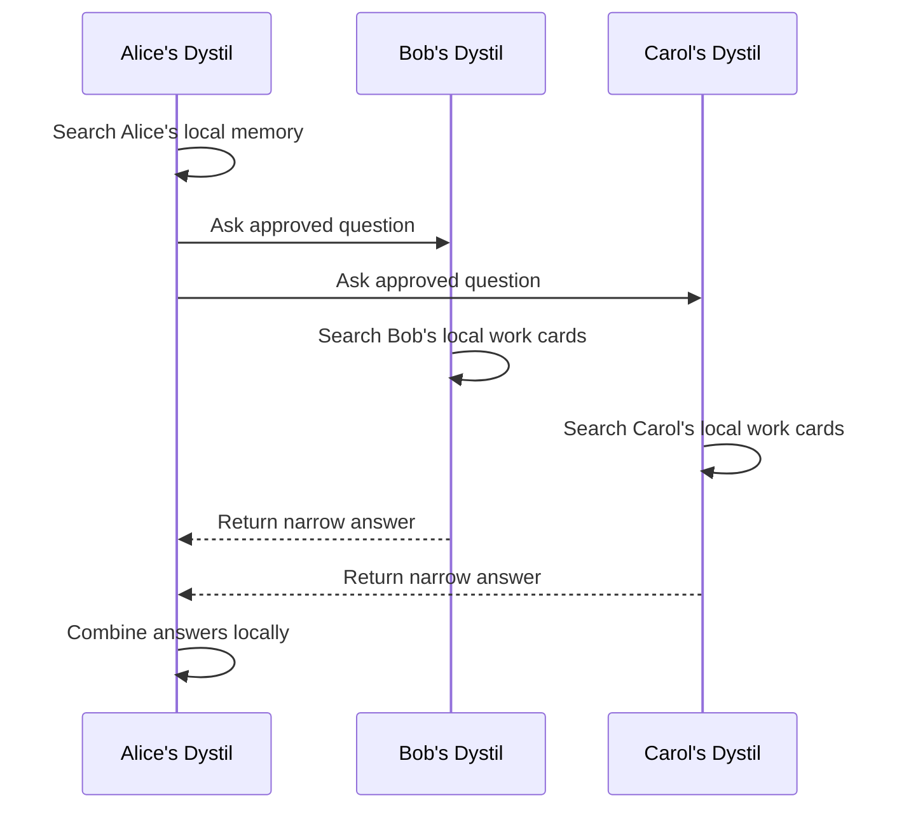

<div align="center">
  

  <h1>Dystil</h1>

  <p><strong>Dystil knows what you've been working on—and helps you find it again.</strong></p>
  <p>A private desktop memory that observes your work, remembers useful context, and answers questions about what you did.</p>

  <p><code>Rust</code> · <code>Tauri v2</code> · <code>Next.js</code> · <code>SQLite</code> · <code>llama.cpp</code></p>

  <p>
    <a href="#quick-start">Quick start</a> ·
    <a href="#how-it-works">How it works</a> ·
    <a href="#architecture">Architecture</a> ·
    <a href="#privacy-model">Privacy</a>
  </p>
</div>

<p align="center">
  
</p>

Dystil runs alongside your normal apps and builds a private memory of your work as it happens. Later, you can ask a question in plain language and get an answer grounded in the tasks, tools, documents, decisions, errors, and outcomes Dystil observed.

You do not have to stop and write notes for Dystil to be useful. It automatically turns completed work sessions into searchable **work cards**, then finds the relevant cards when you need to recover context.

> **Ask Dystil about your work**
>
> “What was I working on yesterday?”<br>
> “Where did I see that API error, and what caused it?”<br>
> “What changed before the release broke?”<br>
> “How did I solve this problem last time?”

Unlike a general-purpose chatbot, Dystil answers from the context of **your actual work history**. Under the hood, it observes accessibility data, UI events, application metadata, and optional screenshots; can redact sensitive information locally; and uses local models to structure and retrieve what matters.

**Local by default. Shared deliberately.**

---

## Why Dystil

### Remember without taking notes

Dystil captures useful context while you work across applications, documents, tools, and conversations. It distills that activity into structured memory, so you do not have to reconstruct every task from browser history, scattered messages, or memory.

### Ask questions grounded in your work

Search by meaning, not just exact keywords. Dystil can connect a question to the relevant task, applications, entities, actions, and outcome, then return the context you need to continue working.

### Keep that context private

Capture, redaction, storage, generation, embeddings, and search can all run on your machine. No Dystil account, hosted database, or external LLM provider is required.

---

## Quick start

### Prerequisites

- Rust toolchain
- Platform-specific Tauri dependencies
- Node.js and the repository package manager

### Run the desktop app

```bash
cargo run --manifest-path apps/dystil/src-tauri/Cargo.toml
```

### Build it

```bash
cargo build --manifest-path apps/dystil/src-tauri/Cargo.toml
```

The first launch downloads approximately **1.5 GB** of local model files. Later launches reuse the cached models in:

```text
~/.dystil/models/
```

---

## How it works

<p align="center">
  
</p>



| Stage | What happens |
| --- | --- |
| **Capture** | Dystil reads operating-system accessibility data, application metadata, UI events, and optional screenshots. |
| **Redact** | Sensitive values can be removed locally before downstream processing. |
| **Window** | Events are grouped into bounded work sessions so the model receives coherent context. |
| **Distill** | Qwen3.5-2B generates a validated JSON work card. |
| **Embed** | LFM2.5-Embedding-350M produces a local semantic vector. |
| **Retrieve** | BM25, vector similarity, metadata filters, and local reasoning resolve questions. |

---

## Work cards

A work card is the stable memory unit inside Dystil: compact enough to search and synchronize, but structured enough to reason over.

```json
{
  "title": "Debugged failed Windows release workflow",
  "summary": "Investigated a GitHub Actions release failure caused by missing Cloudflare R2 environment variables.",
  "activity_type": "debugging",
  "applications": ["Terminal", "GitHub", "VS Code"],
  "entities": ["GitHub Actions", "Cloudflare R2", "Tauri"],
  "actions": [
    "Reviewed release workflow",
    "Inspected environment configuration",
    "Updated required R2 variables"
  ],
  "outcome": "Release workflow configuration identified and corrected"
}
```

Raw activity and long-term memory remain separate, allowing different retention and sharing policies for each.

---

## Architecture

| Layer | Technology |
| --- | --- |
| Desktop shell | Tauri v2 |
| Frontend | Next.js, React, TypeScript |
| Backend | Rust, Tokio |
| Local database | SQLite via SQLx |
| Local inference | `llama.cpp` via `llama-server` |
| Generator | Qwen3.5-2B |
| Embeddings | LFM2.5-Embedding-350M |
| Redaction | Local ONNX models + deterministic detectors |
| Agent integration | Model Context Protocol |
| Multiplayer | Peer protocol with optional sync infrastructure |

### Local model runtime

Dystil starts, health-checks, monitors, and shuts down two local inference processes with the application:

| Process | Port | Model | Approx. size | Purpose |
| --- | ---: | --- | ---: | --- |
| Generator | `18097` | Qwen3.5-2B-Q4_K_M | 1.28 GB | Work-card generation and local reasoning |
| Embedder | `18098` | LFM2.5-Embedding-350M-Q4_K_M | 229 MB | Semantic embeddings |

<details>
<summary><strong>Full component graph</strong></summary>



</details>

<details>
<summary><strong>Repository map</strong></summary>

```text
apps/
  dystil/              Tauri desktop app with a Next.js frontend
  dystil-lite/         Lightweight capture-only variant

crates/
  dystil-capture/      Accessibility, UI-event, window, and optional visual capture
  dystil-storage/      SQLite schema, migrations, persistence, and queries
  dystil-work-cards/   Window processing, prompts, validation, and embeddings
  dystil-ai/           Local AI provider interfaces and inference integration
  dystil-redact/       Local sensitive-text redaction
  dystil-mcp/          Approved Dystil capabilities exposed through MCP
  dystil-engine/       Optional orchestration and synchronization engine
  dystil-sync/         Optional peer and cloud synchronization
  dystil-protocol/     Multiplayer and wire-protocol types
```

</details>

---

## Multiplayer, without centralizing everyone

<p align="center">
  
</p>

Each person runs and owns their own Dystil instance.

When a team-level question is asked, Dystil can route the question to relevant peers. Each peer searches its own work cards locally and returns only the configured response, such as:

- A generated answer
- Relevant work-card summaries
- Sanitized evidence and timestamps
- Confidence information
- A request for deeper-access approval

Peers do **not** need to send continuous screenshots, complete accessibility trees, raw UI events, unrelated activity, or their entire work-card database.

Supported deployment shapes include single-user local mode, trusted-LAN peer Q&A, self-hosted team infrastructure, and opt-in managed synchronization.

<details>
<summary><strong>Peer query flow</strong></summary>



</details>

---

## Privacy model

Privacy is a data-flow constraint, not an after-the-fact policy.

| Boundary | Default behavior |
| --- | --- |
| Raw activity | Stored on the originating device in SQLite |
| Inference | Runs in local `llama-server` processes |
| Screenshots | Optional |
| Sensitive text | Can be redacted locally before long-term memory or model processing |
| Accounts and hosted services | Not required |
| Team sharing | Explicit, narrow, configurable, and opt-in |
| Synchronization | Optional extension, not a prerequisite |

Dystil does not assume that local software is automatically invulnerable. Deployment security still depends on the operating system, filesystem permissions, device encryption, network configuration, enabled integrations, and selected sharing policies.

Please report security issues privately rather than opening a public issue.

---

## Project status

Dystil is under active development. Current priorities are reliable local capture, high-quality work-card generation, fast retrieval, privacy-preserving peer Q&A, and clear control over what can leave a device.

Interfaces, schemas, model choices, protocols, and work-card formats may change while the architecture is refined.

---

## License

Licensed under the Apache License 2.0.
