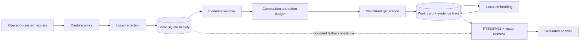
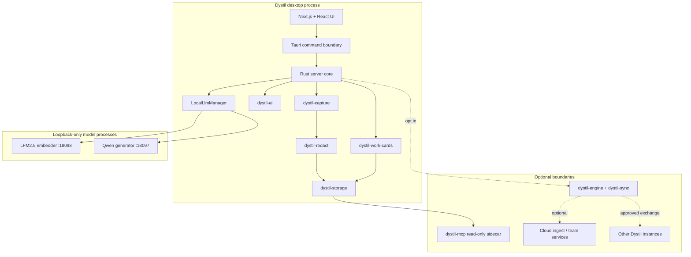

# Dystil Technical Architecture

> Status: living technical narrative for product, engineering, security, and partner conversations. The repository is the source of truth where this document and the implementation differ.

## Executive summary

Dystil is a local-first memory system for desktop work. It observes activity across applications, converts noisy interaction data into compact and evidence-linked **work cards**, and retrieves the relevant cards when a user asks about past work.

The central architectural decision is to separate three kinds of data:

1. **Raw activity** — accessibility content, application and window metadata, UI events, and optional screenshots.
2. **Structured memory** — bounded, model-generated work cards that summarize a coherent period of activity and retain links to supporting evidence.
3. **Shared answers** — narrow, policy-controlled responses that may leave a device when optional team or synchronization features are enabled.

That separation makes local operation the default while leaving room for deliberate collaboration. Capture, deterministic redaction, storage, work-card generation, embeddings, retrieval, and answering can run on the user's device. Accounts and hosted services are optional extensions rather than prerequisites for the core memory loop.

## System goals

Dystil is designed to:

- recover work context without requiring continuous manual note-taking;
- search by meaning as well as exact terms;
- ground generated memory in captured evidence;
- keep raw activity on the originating device by default;
- degrade gracefully when a model or optional service is unavailable;
- expose a narrow, read-only memory interface to approved AI clients;
- support team questions without requiring a centralized copy of everyone's raw activity.

It is not designed to treat every captured event as permanent memory, upload an unfiltered desktop history by default, or use a language model as the authoritative store of record.

## End-to-end data flow



The pipeline turns high-volume, low-level observations into progressively smaller and more useful representations. Raw evidence remains available locally for bounded inspection, while normal recall starts from work cards.

## Runtime topology

The product is a Tauri v2 desktop application with a Next.js/React interface and a Rust backend. Tokio coordinates capture, redaction, work-card processing, local inference, retrieval, and optional synchronization work.



### Major repository components

| Component | Responsibility |
| --- | --- |
| `apps/dystil` | Desktop product: Next.js frontend, Tauri shell, command layer, workers, settings, and lifecycle management. |
| `crates/dystil-capture` | Accessibility collection, UI events, window/application context, capture triggers, policy, and optional visual capture. |
| `crates/dystil-redact` | Deterministic sanitization and optional local ONNX text redaction. |
| `crates/dystil-storage` | SQLite bootstrap, persistence, FTS indexes, work-card evidence links, and retrieval queries. |
| `crates/dystil-work-cards` | Evidence windowing, compaction, prompt construction, schema validation, and work-card generation helpers. |
| `crates/dystil-ai` | AI context construction and provider/inference integration. |
| `crates/dystil-mcp` | Read-only Model Context Protocol server over derived local memory. |
| `crates/dystil-engine` | Periodic orchestration for optional work-insights synchronization. |
| `crates/dystil-sync` | Segmentation, cursors, evidence packaging, image handling, and sync behavior. |
| `crates/dystil-protocol` | Shared serialized types for agent, evidence, and wire-protocol boundaries. |
| `cloud` | Optional authenticated ingest and team infrastructure backed by Postgres. |

## 1. Capture layer

Dystil collects contextual signals through operating-system accessibility APIs and UI-event sources. Depending on platform, permissions, and user settings, an observation can include:

- timestamp and device context;
- foreground application and window title;
- browser URL or document path where available;
- accessibility text and element structure;
- input-event metadata;
- an optional screenshot reference.

Capture is policy-aware. The capture crate includes application/window pattern handling, incognito detection, screen-lock awareness, monitor selection, and platform-specific providers for macOS, Windows, and Linux. Optional screenshot capture is distinct from accessibility and event capture so it can be disabled without disabling the entire memory pipeline.

### Why accessibility-first

Accessibility data often provides text and semantic UI structure without requiring continuous image interpretation. This makes it cheaper to process, easier to search, and more amenable to targeted redaction than a video-first design. Screenshots remain useful where semantic interfaces are incomplete, but are an optional supporting signal rather than the only source of context.

## 2. Privacy and redaction layer

Privacy controls sit in the write path, not only at the sharing boundary.

The current pipeline uses two complementary mechanisms:

- **Deterministic detection and sanitization** for high-risk patterns such as credentials and other secret-like values. This baseline runs before capture text is written to SQLite.
- **Optional local ONNX redaction** for configurable PII classes. A background worker can rewrite eligible stored surfaces; when the model is unavailable, the system falls back to deterministic redaction.

The database tracks redaction status and attempts per source row and surface. This allows redaction work to be retried and audited without treating the whole record as an opaque blob.

Redaction lowers exposure risk but is not a proof that captured data contains no sensitive information. Product controls, OS permissions, disk encryption, filesystem permissions, retention behavior, and sharing policy remain part of the security boundary.

## 3. Local storage layer

Dystil uses SQLite through SQLx for the local data plane. The database is configured with write-ahead logging, a bounded connection pool, and a busy timeout to support concurrent capture, UI-event, and redaction writers while allowing reads to continue.

Important logical tables include:

- `frames` for time-stamped application, window, capture, and extracted-text context;
- `elements` for structured accessibility elements associated with frames;
- `ui_events` for normalized interaction events and their application context;
- `dystil_text_redaction_state` for background privacy-processing state;
- `work_cards` for the derived long-term memory unit;
- `work_card_evidence` for links from claims/cards back to source rows;
- FTS5 virtual tables for activity and work-card lexical retrieval.

Raw observations and derived cards are intentionally stored as different entities. They can therefore have different retention, sync, and access policies.

## 4. Evidence windowing and compaction

Individual UI events are too granular to be useful memories, while an entire workday is too broad for a small local model. Dystil groups ordered evidence into bounded windows.

The current default window configuration closes a window after:

- five minutes of inactivity;
- fifteen minutes of maximum elapsed duration;
- a device change; or
- the end of available closed input.

Window identifiers are deterministically derived from device, time, and source identifiers. Before model invocation, evidence is sanitized, deduplicated/compacted, and fitted to a token budget. This reduces repetition while retaining evidence identifiers needed for grounding.

The final open-ended window is deferred until sufficiently old, preventing the system from summarizing a task that is still actively unfolding.

## 5. Work cards: the durable memory unit

A work card is a structured interpretation of a bounded activity window. Its schema includes:

- title;
- evidence-grounded summary;
- applications;
- artifacts, such as files, URLs, or named objects;
- evidence-grounded actions;
- last observed state;
- status (`completed`, `in_progress`, `blocked`, or `unknown`);
- uncertainties;
- model and source metadata;
- optional embedding;
- evidence links.

Conceptually:

```json
{
  "title": "Diagnosed a failed release workflow",
  "summary": {
    "text": "Traced the release failure to missing deployment configuration.",
    "evidence_ids": ["e_12", "e_18"]
  },
  "applications": ["Terminal", "GitHub", "VS Code"],
  "actions": [
    {
      "text": "Compared the workflow with the deployment environment.",
      "evidence_ids": ["e_15", "e_18"]
    }
  ],
  "last_observed_state": {
    "text": "The missing variables were identified.",
    "evidence_ids": ["e_22"]
  },
  "status": "completed",
  "uncertainties": []
}
```

Generated output is parsed and validated against this schema before persistence. The system also records source hashes and uses upsert semantics, making regeneration deterministic at the storage boundary and avoiding duplicate cards for the same window.

Evidence IDs matter: they distinguish a grounded summary from an unsupported free-form model recollection. Uncertainties give the generator a place to preserve ambiguity rather than silently inventing certainty.

## 6. Local model runtime

Dystil manages `llama-server` processes bound to the loopback interface:

| Purpose | Model | Port | Runtime behavior |
| --- | --- | ---: | --- |
| Embeddings | LFM2.5-Embedding-350M, Q4_K_M | `18098` | Prepared as local retrieval infrastructure. |
| Generation | Qwen3.5-2B, Q4_K_M | `18097` | Enabled on demand for work-card generation and local reasoning. |

The manager resolves a bundled or PATH-provided `llama-server`, downloads missing runtime/model assets, starts child processes, checks their health, and shuts them down with the app. Model endpoints listen on `127.0.0.1`, not on external network interfaces.

The generator uses a 16K context configuration. The embedder has a smaller embedding-oriented context and CPU configuration. Environment-based endpoints can replace the managed local endpoint for development or explicitly configured provider flows.

Model names, quantizations, and runtime versions are implementation choices, not permanent protocol contracts. Work cards persist their model identifiers so downstream behavior can be understood as models evolve.

## 7. Retrieval and answering

Dystil uses hybrid retrieval because lexical and semantic search fail in different ways:

- **FTS5/BM25** is strong for exact terms such as error strings, filenames, application names, and identifiers.
- **Vector similarity** is strong when the query and memory use different wording but express the same intent.
- **Time and metadata filters** narrow the candidate set when a question specifies a day, application, or time range.

Embeddings are stored with their dimensionality and model identifier. Vector search only compares compatible dimensions and ranks candidates using cosine similarity. Hybrid search merges lexical and semantic candidates before the answer layer builds bounded context.

The preferred recall order is:

1. search derived work cards;
2. inspect evidence linked to promising cards;
3. query sanitized raw activity only when cards are insufficient;
4. generate an answer that does not claim unsupported activity as fact.

This ordering keeps normal queries fast and compact while preserving a route to deeper evidence.

## 8. MCP integration

`dystil-mcp` exposes local memory to approved Model Context Protocol clients through a small stdio server. The sidecar opens the capture database read-only and reserves stdout for JSON-RPC.

Its default access mode exposes work cards. A separate activity mode can expose sanitized search projections and bounded context, but never screenshots or complete accessibility trees. Tool annotations mark operations as read-only, idempotent, non-destructive, and closed-world. Response size and per-session call budgets provide additional containment.

This architecture lets an external agent ask Dystil about prior work without granting that agent arbitrary write access to Dystil's local database.

## 9. Optional sync and team architecture

Local operation does not require cloud infrastructure. When synchronization is enabled, the local system turns eligible evidence into versioned, content-addressed segments. The optional ingest service validates compressed payload hashes, segment revisions, and canonical content hashes before atomically upserting them into Postgres. Identical retries are idempotent.

Authentication separates user sessions from background device ingestion:

- interactive user and report endpoints use an authenticated user session;
- registered devices receive scoped credentials for background ingest;
- the server resolves canonical organization, user, and device identities before writes.

The broader multiplayer direction preserves local ownership: a peer can search its own cards and return a narrow answer, sanitized evidence, timestamps, confidence, or a request for approval. Continuous raw capture does not need to be replicated to every participant for team-level questions to work.

Because this layer is optional and under active development, deployment shape, policy granularity, and protocol details should be presented as evolving capabilities rather than fixed guarantees.

## 10. Trust boundaries

| Boundary | Default or intended constraint |
| --- | --- |
| OS → capture | Collection depends on explicit platform permissions and capture policy. |
| Capture → SQLite | Deterministic secret sanitization runs before text writes; optional model redaction adds configurable coverage. |
| SQLite → local models | Processing can remain on-device through loopback-only model servers. |
| SQLite → MCP | Sidecar opens the database read-only and exposes derived/sanitized tools. |
| Device → peer/team | Sharing is optional, narrow, and policy-controlled. |
| Device → cloud | Sync is optional; payloads are versioned, validated, and authenticated. |

“Local-first” should not be interpreted as “automatically secure under every device configuration.” A compromised OS account, permissive filesystem access, disabled disk encryption, or intentionally enabled integrations can change the practical threat model.

## 11. Failure handling and graceful degradation

The architecture favors partial utility over an all-or-nothing startup:

- if the ONNX redactor is unavailable, deterministic redaction remains active;
- if the local embedder cannot start, lexical retrieval remains possible;
- if generation is unavailable, capture and stored history can continue;
- health checks prevent the app from assuming a child model process is ready;
- port ownership checks avoid mistaking a stale process for the app's managed server;
- source hashes, revisions, and idempotent upserts make retries safer;
- raw evidence remains separate from generated cards, so a failed generation pass does not destroy the source material.

## 12. Current limitations and design evolution

Dystil is under active development. Important areas still being refined include:

- capture quality and platform parity across macOS, Windows, and Linux;
- the precision/recall trade-off of local redaction;
- work-card evaluation, compaction, and grounding quality;
- local model latency and hardware support;
- ranking and answer-quality evaluation;
- retention and user-facing sharing controls;
- peer discovery, authorization, and multiplayer policy;
- production sync and team deployment ergonomics.

Any public claim should distinguish the implemented local memory loop from optional or evolving team infrastructure.

## 13. Architectural principles

The implementation can change while these principles remain stable:

1. **Raw activity is not the product output.** It is source evidence used to construct useful memory.
2. **Derived memory must remain inspectable.** Work cards retain evidence links and uncertainty.
3. **Local is the default data plane.** Networked features are explicit extensions.
4. **Privacy is enforced at boundaries.** Capture policy, redaction, read-only access, and narrow sharing are architectural controls.
5. **Retrieval precedes generation.** Answers should be grounded in selected memory, not free-form model recall.
6. **Optional dependencies should fail softly.** Capture and recall should retain as much utility as possible when models or services are unavailable.
7. **Protocols outlive model choices.** Model/runtime details can evolve without redefining the core memory abstraction.

## Source map

For implementation-level detail, start with:

- [`README.md`](../README.md)
- [`apps/dystil/src-tauri/src/server_core.rs`](../apps/dystil/src-tauri/src/server_core.rs)
- [`apps/dystil/src-tauri/src/local_llm.rs`](../apps/dystil/src-tauri/src/local_llm.rs)
- [`crates/dystil-capture`](../crates/dystil-capture)
- [`crates/dystil-redact`](../crates/dystil-redact)
- [`crates/dystil-storage/src/lib.rs`](../crates/dystil-storage/src/lib.rs)
- [`crates/dystil-storage/src/work_cards.rs`](../crates/dystil-storage/src/work_cards.rs)
- [`crates/dystil-work-cards`](../crates/dystil-work-cards)
- [`crates/dystil-mcp/src/main.rs`](../crates/dystil-mcp/src/main.rs)
- [`cloud/README.md`](../cloud/README.md)

